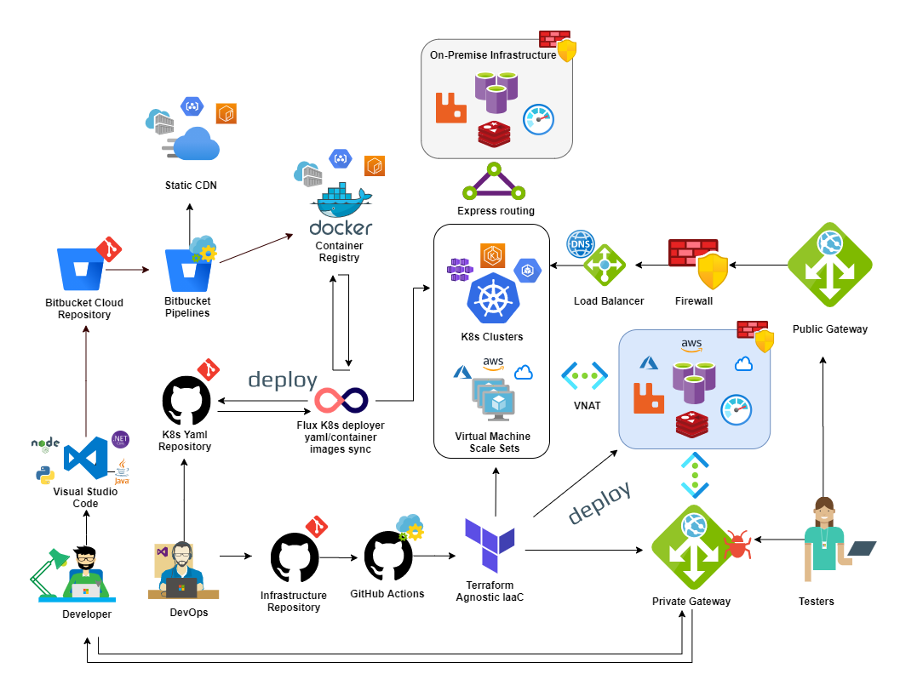

# Proof of Concept

This repository contains infrastructure configurations and services in order to achieve a solution for a subscriptions system regarding the following challange requirements

[challange.pdf](documentation/challange.pdf)

# What is in this repository

- **[infrastructure/](infrastructure/)**	  
	- **[docker/](infrastructure/docker)**		  
		- _docker-compose infrastructure_
	- **[services/](infrastructure/services/)**		  
		- **[gateways/](infrastructure/services/gateways/)**	   
			- **[public/](infrastructure/services/gateways/public/)**  
				- _configurations for the public gateway_ 
			- **[private/](infrastructure/services/gateways/private/)** 
				- _configurations for the private internal gateway_
		- **[rabbitmq/](infrastructure/services/rabbitmq/)**	   
			- **[etc/](infrastructure/services/rabbitmq/etc/)**	  
				- _configurations for RabbitMQ message broker_
			- **[lb/](infrastructure/services/rabbitmq/lb/)**	  
				- _nginx load balancer for RabbitMQ_
- **[microservices/](microservices/)**	  
	- **[api.client.subscriptions/](microservices/api.client.subscriptions/)**	  
		- _public subscriptions api_
	- **[api.core.subscriptions/](microservices/api.core.subscriptions/)**	  
		- _private subscriptions api_
	- **[api.core.mail/](microservices/api.core.mail/)**	  
		- _private email deliverer api_

# Microservices in this repository

Please, take a look at the general documentation in this section
[microservices/](microservices/)

# Solution architecture topology

The architecture for running this project is based on docker-compose and follows the topology bellow
take a look at: [infrastructure\docker\docker-compose.yml](infrastructure\docker\docker-compose.yml)

```go
    |-> public-gateway              	- network:  public
		|-> api.client.subscriptions    - network:  public + private
	   	  |-> api.core.subscriptions    - network:  private
			|-> api.core.mail		    - network:  private
		|-> private-gateway		        - network:  public + private
	   	  |-> RabbitMQ (cluster)        - network:  private
		    |-> rabbit-1		        - network:  private
		    |-> rabbit-2		        - network:  private
	   	  |-> SMTP server             	- network:  private
	   	  |-> SEQ logs server           - network:  private
```


# Explaining the different components


## Networking

There are two different types of networks public and private.

**The public network**

- hosts public APIs and applications that can must be reachable from the internet. 

**The private network**
- hosts core services, the private and the most critical ones so to speak.


## Services


**[The public-gateway](infrastructure/services/gateways/public/)**
- is placed in the public network
- cannot reach private services.
- routes incomming requests thru:
	- the public api.client.subscriptions
	- the private-gateway
- exposes internal services to the internet
- access control
- validate tokens 
- authenticate endpoints
- produce logs

**[The private gateway](infrastructure/services/gateways/private/)**
- can reach services in the public network
- can reach services in the private network 
- increases control over security (when exposing dashboards)
- increases control over monitoring
- restricts access to the private network
- exposes partial private services to the public network

**The [api.client.subscriptions](microservices/api.client.subscriptions/readme.md)**

- stands for basically handling requests for subscriptions creation
- can reach services in the public network
- can reach services in the private network 

**The [RabbitMQ (cluster)](infrastructure/services/rabbitmq/lb/nginx.conf)**
- is an Nginx load balancer
- is composed by two rabbitMQ servers in the cluster (rabbit-1, rabbit2)
- only reachable inside the private network
- provides dashboards messages queuing
- provides a way of publishing new event messages

**The [SMTP server](https://archive.codeplex.com/?p=smtp4dev)**
- is a simple SMTP/Mail Inbox server
- SMTP only reachable in the private network
- Mail inbox reachable exposed by private/public gateways

**The [SEQ log server](https://datalust.co/)**
- is a simple tool for monitoring logs produced by the APIs.


# Interesting Links


**RabbitMQ cluster manager**
http://localhost:8080/private/mq
*(user: guest | pass: guest)*

**SEQ Logging dashboards**
http://localhost:8080/private/seq

**Mail inbox dashboards**               
http://localhost:8080/private/mail

**Public API**	
http://localhost:8080/public/subscriptions/swagger/


*you'll need the following credentials in order to see the private links above*
_username: **admin**_
_password: **admin**_


# How to build and run

**Make sure that you have docker installed on your local machine**

[https://www.docker.com/get-started](https://www.docker.com/get-started)

_**optional**: if you want to download the dotnet core SDK in order to build the APIs locally, you can download it from here:
[https://dotnet.microsoft.com/download](https://dotnet.microsoft.com/download)_

**Clone the repository**
```shell
    git clone git@bitbucket.org:jsoliveira/iban-services-poc.git
```

**Set the current working directory**

```shell
    cd infrastructure/docker
```

**Clean up your docker environment**

```shell
    #!/bin/sh
    rm -f  ~/.docker/config.json;
    docker-compose down
    docker system prune --all
    docker network prune -f
```

**Startup the containers**

```shell
    docker-compose up --force-recreate --remove-orphans;
```

**optional:** You can use docker-compose to build and start up a single API:

```shell
	# docker-compose build <api_name>;
    docker-compose build api.client.subscription;
    docker-compose up --force-recreate --remove-orphans api.client.subscription;
```

_if you want to debug/start up an API using the SDK please take a look at the API documentation in this repository._

---
### Important Note
RabbitMQ cluster can take up to 2 minutes to get initialized


**Check if RabbitMQ is already up and running**
[http://localhost:8080/mq/](http://localhost:8080/mq/)

 
**Then check if the public API is also running**
[http://localhost:8080/public/subscriptions/swagger/](http://localhost:8080/public/subscriptions/swagger/)

---

# CI/CD Integration

This repository is taking advantage of bitbucket-pipelines in order to push container images to docker hub container registry 

- [https://hub.docker.com/r/jsoliveira/api.client.subscriptions/tags](https://hub.docker.com/r/jsoliveira/api.client.subscriptions/tags)
- [https://hub.docker.com/r/jsoliveira/api.core.subscriptions/tags](https://hub.docker.com/r/jsoliveira/api.core.subscriptions/tags)
- [https://hub.docker.com/r/jsoliveira/api.core.mail/tags](https://hub.docker.com/r/jsoliveira/api.core.mail/tags)

you can see the pipeline working here [https://bitbucket.org/jsoliveira/iban-services-poc/addon/pipelines/home/](https://bitbucket.org/jsoliveira/iban-services-poc/addon/pipelines/home/)


# Basic Cloud Architecture

