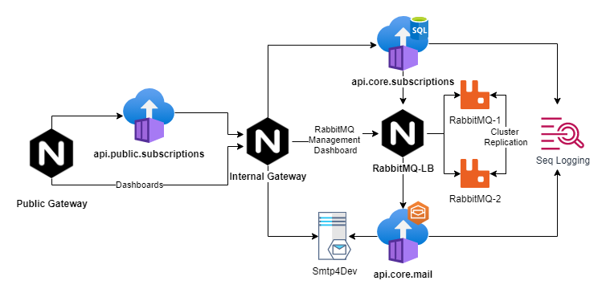

# What is in this repository

- **[infrastructure/](infrastructure/)**	  
	- **[docker/](infrastructure/docker)**		  
		- _docker-compose infrastructure_
	- **[kubernetes/1.19.3](infrastructure/kubernetes/1.19.3)**		  
		- _kubernetes infrastructure_
- **[services/](services/)**		  
	- **[gateways/](services/gateways/)**	   
		- **[public/](services/gateways/public/)**  
			- _configurations for the public gateway_ 
		- **[private/](services/gateways/private/)** 
			- _configurations for the private internal gateway_
	- **[rabbitmq/](services/rabbitmq/)**	   
		- **[etc/](services/rabbitmq/etc/)**	  
			- _configurations for RabbitMQ message broker_
		- **[lb/](services/rabbitmq/lb/)**	  
			- _nginx load balancer for RabbitMQ_
	- **[grafana/](services/grafana/)**	   
		- _grafana monitoring configurations_
	- **[prometheus/](services/prometheus/)**	   
		- _prometheus metrics collecting configurations_
	- **[promtail/](services/promtail/)**	   
		- _promtail log files parser configurations_
- **[apis/](apis/)**	  
	- **[api-client-subscriptions/](apis/api-client-subscriptions/)**	  
		- _public subscriptions api_
	- **[api-core-subscriptions/](apis/api-core-subscriptions/)**	  
		- _private subscriptions api_
	- **[api-core-mail/](apis/api-core-mail/)**	  
		- _private email deliverer api_

# apis in this repository

Please, take a look at the general documentation in this section
[apis/](apis/)

# Solution architecture topology (Docker)

The architecture for running this project is based on docker-compose and follows the schema bellow

for more details you can take a look at: 
- [infrastructure/docker/docker-compose.yml](infrastructure/docker/docker-compose.yml)




# Explaining the different components


## Networking

There are two different types of networks: public and private.

**The public network**

- stands for hosting public APIs and applications that need to be reachable from the internet. 

**The private network**

- stands for hosting core services (private or the most critical services so to speak).


## Services


**[The public-gateway](services/gateways/public/)**
- 
it's hosted in the public network
- it cannot reach private services.
- it routes incomming requests thru:
	- the public api-client-subscriptions
	- the private-gateway
- it exposes specific internal/private services
- it takes control of what resources have been accessed
- it authenticate internal endpoints
- it take control over one first layer of security ( like validating auth tokens against an identity server, for instance) 
- it produces interesting logs

**[The private gateway](services/gateways/private/)**

- it routes traffic to specific services in the private network 
- it increases control over security (when exposing internal dashboards)
- it increases control over monitoring
- it restricts access to the private network
- it exposes partial private services to the public network

**The [api-client-subscriptions](apis/api-client-subscriptions/readme.md)**

- it stands for basically handling requests for subscriptions creation
- it can reach services in the public network
- it can reach services in the private network 

**The [RabbitMQ (cluster)](services/rabbitmq/lb/nginx.conf)**

- it is an Nginx load balancer
- it is composed by two rabbitMQ servers in the cluster (rabbit-1, rabbit2)
- it is only reachable inside the private network
- it provides dashboards with metrics about the existing message queues
- it provides a way of publishing new event messages without needing of external tools and API's 

**The [SMTP server](https://archive.codeplex.com/?p=smtp4dev)**

- it is a simple SMTP/Mail Inbox server
- the SMTP port can only be reachable in the private network
- the Mailing box is exposed thru the private and public gateways for testing purposes

**The [SEQ log server](https://datalust.co/)**

- it's a simple tool for monitoring logs produced by the APIs.
- it can produce nice dashboards to take control over what's happening the APIs
- the dashboard service is exposed thru the private and public gateway for testing purposes

# How to build and run (Docker)

**Make sure that you have docker installed on your local machine**

[https://www.docker.com/get-started](https://www.docker.com/get-started)

_**optional**: if you want to download the dotnet core SDK in order to build the APIs locally, you can download it from here:
[https://dotnet.microsoft.com/download](https://dotnet.microsoft.com/download)_

**Clone the repository**
```shell
    git clone git@bitbucket.org:jsoliveira/iban-services-poc.git
```

**Set the current working directory**

```shell
    cd infrastructure/docker
```

**Clean up your docker environment**

```shell
    #!/bin/sh
    rm -f  ~/.docker/config.json;
    docker-compose down
    docker system prune --all
    docker network prune -f
```

**Startup all containers**

```shell
    docker-compose -f "infrastructure/docker/docker-compose.yml" up --force-recreate --remove-orphans --build
```

**Startup a single container**

```shell
	# docker-compose build <api_name>;
    docker-compose -f "infrastructure/docker/docker-compose.yml" up --force-recreate --remove-orphans --build api-client-subscription;
```

_if you want to debug or startup an API using the dotnet core SDK please take a look at the existing API documentation in this repository [apis/](apis)_


# How to deploy into Kubernetes Cluster

For demo purposes the public gateway is exposed using a NodePort service
[infrastructure/kubernetes/1.19.3/gateways/public-gateway/service.yml](infrastructure/kubernetes/1.19.3/gateways/public-gateway/service.yml)
```shell
	kubectl kustomize  "infrastructure/kubernetes/1.19.3/" | kubectl apply -f -
```

The public gateway is exposed on port 8080.

These are the URLs available :

[http://localhost:8080/public/subscriptions/swagger/index.html](http://localhost:8080/public/subscriptions/swagger/index.html)

[http://localhost:8080/private/mq/](http://localhost:8080/private/mq/)

[http://localhost:8080/private/seq/](http://localhost:8080/private/seq/)

[http://localhost:8080/private/seq/](http://localhost:8080/private/smtp/)

The links below are also available thru HTTPS over port **30443**

In a production environment with multiple nodes (VM) the public gateway would be exposed thru an ingress controller or thru a LoadBalance service.

---
# Important Notes

RabbitMQ cluster can take up to **2 minutes** to get up and running (clustering)

While it is initializing, if core.subscription API gets requested it will not responding until it reaches the MQ cluster 

Check the following documentation for more details: **[api-core-subscriptions/](apis/api-core-subscriptions/)**	

**How to make sure that RabbitMQ is already up and running**

Try to reach the RabbitMQ management portal, if you don't get a warning message then you're good to go.

[http://localhost:8080/private/mq/](http://localhost:8080/private/mq/)

 
**How to check if the public API is also running**

If you see the OpenAPI documentation in the following link then it's all set.

[http://localhost:8080/public/subscriptions/swagger/](http://localhost:8080/public/subscriptions/swagger/)

---

# Interesting Links


**RabbitMQ cluster manager**

[http://localhost:8080/private/mq/](http://localhost:8080/private/mq/)
>_credentials : user: guest | pass: guest_

**SEQ Logging dashboards**

[http://localhost:8080/private/seq/](http://localhost:8080/private/seq/)

**Mail inbox dashboards**       

[http://localhost:8080/private/smtp/](http://localhost:8080/private/smtp/)

**Public API Swagger**	

[http://localhost:8080/public/subscriptions/swagger/](http://localhost:8080/public/subscriptions/swagger/)
> _authentication token: any string_


*you'll need the following credentials in order to get authorized by the public gateway to access the private links above*

_username: **admin**_

_password: **admin**_

# CI/CD Integration

This repository has configurations to deploy container images into a container registry.

Docker hub was used as the main container registry for the purpose of this demo)

- [https://hub.docker.com/r/jsoliveira/api-client-subscriptions/tags](https://hub.docker.com/r/jsoliveira/api-client-subscriptions/tags)
- [https://hub.docker.com/r/jsoliveira/api-core-subscriptions/tags](https://hub.docker.com/r/jsoliveira/api-core-subscriptions/tags)
- [https://hub.docker.com/r/jsoliveira/api-core-mail/tags](https://hub.docker.com/r/jsoliveira/api-core-mail/tags)

## Bitbucket Pipelines
[Bitbucket Pipelines](bitbucket-pipelines.yml)

## CI/CD Azure DevOps
[Azure Devops](azure-pipelines.yml)

